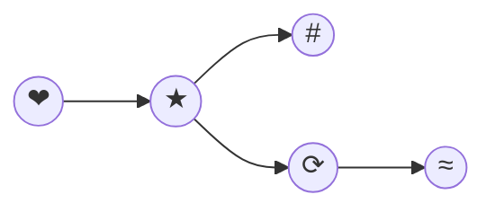

# Identifying a Faulty Commit Using git bisect
Here, I'd like to draw a graph using `mermaid` to use it in the git merge episode.

## Instructions
We have identified an issue in this repository: one of the nodes contains an invalid character, which is causing a rendering problem when trying to preview Markdown with Mermaid diagrams.

To reproduce the issue, install the https://marketplace.visualstudio.com/items?itemName=bierner.markdown-mermaid extension in Visual Studio Code. Then, try to preview the Markdown content. You will encounter an error caused by an invalid character in one of the diagram nodes.

Since the source of the problem is unclear, we will use git bisect to trace the commit that introduced the issue.
